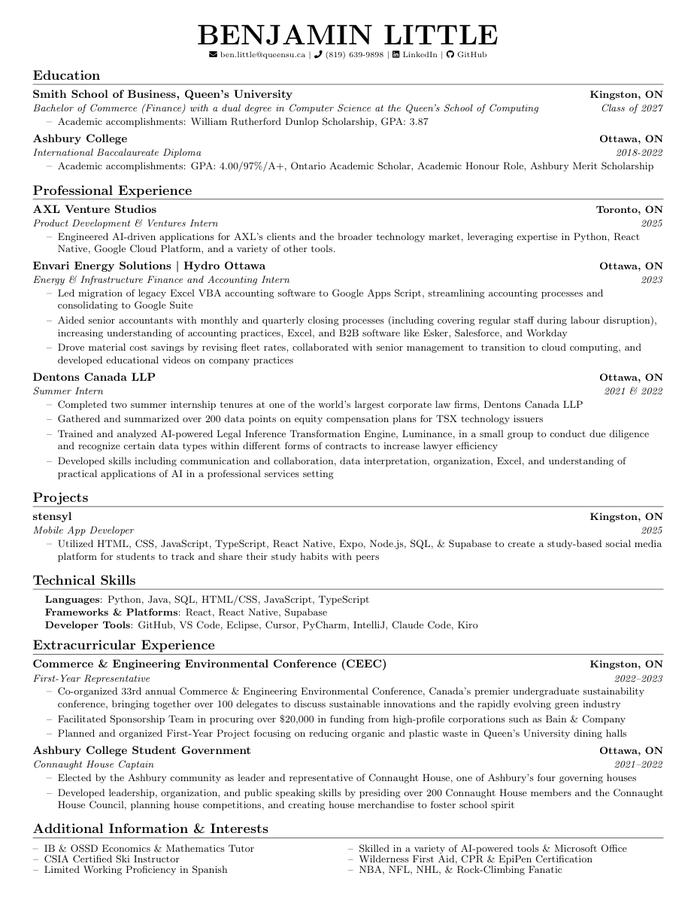

# LaTeX Resume Template

Hey! This is a simple resume template I made for myself and figured I'd share it. It's loosely based off [Jake Gutierrez's template](https://github.com/jakegut/resume). It's clean, fits on one page, and is ATS-friendly.



## How to Use

1. Swap out my info for yours in `BenLittleResume.tex`
2. Compile it:
   ```bash
   pdflatex BenLittleResume.tex
   ```

You'll need a LaTeX distribution (TeX Live, MiKTeX, etc.) and the `fontawesome5` package for the icons.

## License

MIT - do whatever you want with it.
